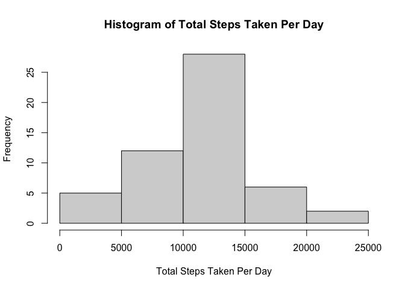
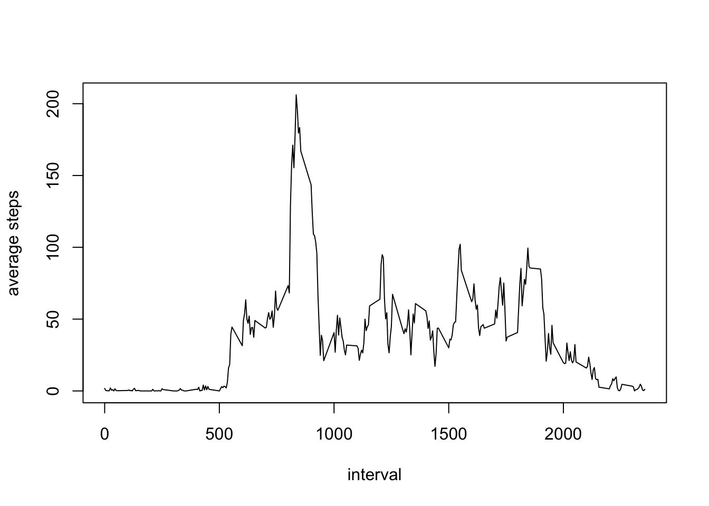
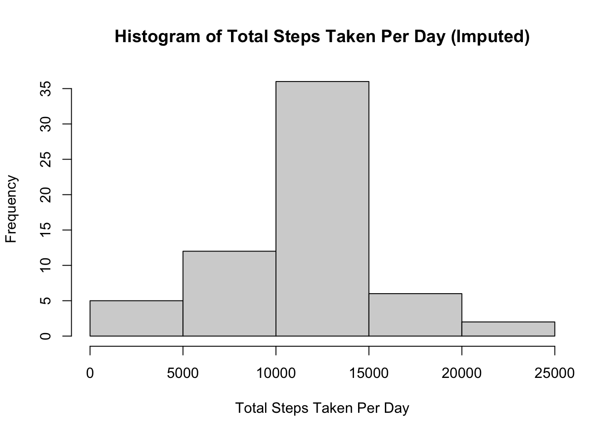
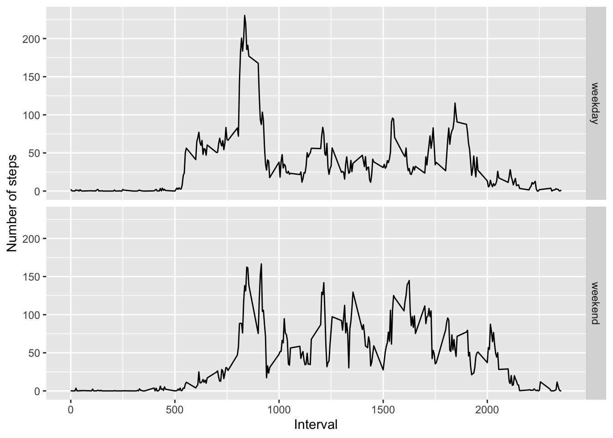

# Data Loading


```r
#first, get data, unzip/load in
url <- 'https://d396qusza40orc.cloudfront.net/repdata%2Fdata%2Factivity.zip'
download.file(url, 'data.zip')
unzip('data.zip') 
data <- read.csv('activity.csv')

#pre-processing
data$date <- as.Date(data$date)
```

# Task 1: Examining the mean total number of steps taken per day.

1. Tally up the total number of steps taken per day:

```r
agg <- aggregate(data['steps'], by=data['date'],sum)
```
2. To look at this, we examine a histogram of this aggregation:


```r
hist(agg$steps, main='Histogram of Total Steps Taken Per Day', xlab='Total Steps Taken Per Day')
```

<!-- -->

3. We calculate and report the mean and median of the total number of steps per day:


```r
options(scipen=999) #let's avoid scientific notation
smry <- summary(agg$steps)
median <- smry[3]
mean <- smry[4]
```
So the mean total steps taken per day is 10766.1886792, and the median of the total steps taken per day is 10765.

# Task 2: Examining the average daily activity pattern.

1. First, we want to aggregate the average number of steps taken daily in each 5-minute interval, across all days, and then make a time-series plot of this information

```r
agg2 <- aggregate(data['steps'], by=data['interval'], mean, na.rm=TRUE)
plot(agg2, type='l', ylab='average steps')
```

<!-- -->

2. Finding the interval that, on average across all days, contains the max: There is a clear interval with a global maximum, so we can subset this down easily and get at the interval in question this way:

```r
agg2[agg2$steps == max(agg2$steps),][1,1]
```

```
## [1] 835
```

# Task 3: Imputing missing values.

1. Calculating the number of NAs: We can apply the is.na function to quickly get this:

```r
nanum <- colSums(is.na(data))
nanum
```

```
##    steps     date interval 
##     2304        0        0
```

We note that only the steps column contains any (as expected), with 2304 total NA values.

2. Next we need to impute the missing values.
For each NA value, we will grab the corresponding mean value for that interval, as computed above, and replace the NA for that interval with the average for that interval.

3. Create new dataset, with the missing values imputed:


```r
#create our new dataset
imputes <- data

#note these first few are indeed NA
head(imputes)
```

```
##   steps       date interval
## 1    NA 2012-10-01        0
## 2    NA 2012-10-01        5
## 3    NA 2012-10-01       10
## 4    NA 2012-10-01       15
## 5    NA 2012-10-01       20
## 6    NA 2012-10-01       25
```

```r
#copy over the NAs by matching up the corresponding values in the earlier aggregation.
imputes[is.na(imputes$steps),]$steps <- agg2$steps[match(imputes[is.na(imputes$steps),]$interval, agg2$interval)]

#see the first few values, which now contain the means
head(imputes)
```

```
##       steps       date interval
## 1 1.7169811 2012-10-01        0
## 2 0.3396226 2012-10-01        5
## 3 0.1320755 2012-10-01       10
## 4 0.1509434 2012-10-01       15
## 5 0.0754717 2012-10-01       20
## 6 2.0943396 2012-10-01       25
```

4. Now recreate the histogram for the total number of steps each day:

```r
agg3 <- aggregate(imputes['steps'], by=imputes['date'],sum)
hist(agg3$steps, main='Histogram of Total Steps Taken Per Day (Imputed)', xlab='Total Steps Taken Per Day')
```

<!-- -->

Then Calculate and report the mean and median steps taken per day after imputation:

```r
options(scipen=999) #let's still avoid scientific notation
smry <- summary(agg3$steps)
imedian <- smry[3]
imean <- smry[4]
```
So the mean total steps taken per day is 10766.1886792, and the median of the total steps taken per day is 10766.1886792. These differ from before by 0 for the mean, and 1.1886792 for the median. Note the minimal difference in the median but not the mean, as would be expected mathematically for this particular procedure.

# Task 4: Activity differences between weekdays and weekends.
1. Create a new factor variable to split the date column by weekdays and weekends:

```r
# first get what day of the week each day is
imputes$wkd <- weekdays(imputes$date)

# convert to the appropriate type and convert to factor
imputes$wkd <- ifelse(imputes$wkd %in% c('Saturday','Sunday'), "weekend","weekday")
imputes$wkd <- as.factor(imputes$wkd)
```

2. Create a panel plot with for the interval and the average number of steps taken for that interval across weekdays/weekends.

```r
#we'll use ggplot2
library(ggplot2)

#plot out the two plots, using ggplot to take the mean, and applying it across a facet grid to give us a plot for each level of the factor
ggplot(imputes, aes(x=interval, y=steps)) + geom_line(stat='summary', fun='mean') + labs(x='Interval', y='Number of steps') + facet_grid( rows=vars(wkd))
```

<!-- -->
